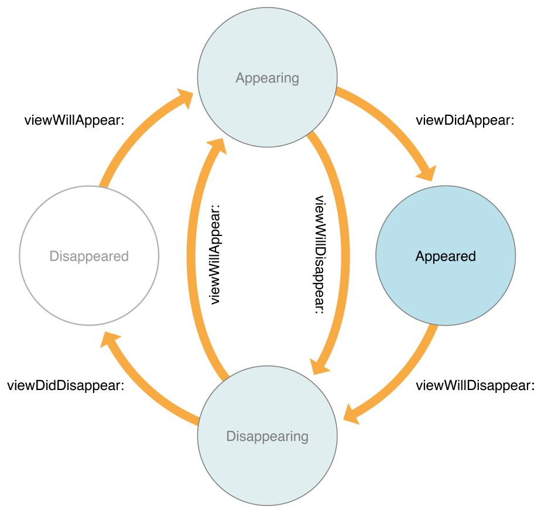

# Apuntes de teoría — videos y repaso conceptual

Notas tomadas mientras se ven los videos recomendados en `Homework.md` (temas que no son parte de un proyecto de código puntual). Formato libre por tema; lo importante es que quede el concepto, no el video.

---

## Vistas y su ciclo de vida (UIKit)

Los 4 estados (`Disappeared` → `Appearing` → `Appeared` → `Disappearing` → `Disappeared`) y los callbacks que marcan cada transición:

- `viewWillAppear:` — Disappeared → Appearing
- `viewDidAppear:` — Appearing → Appeared
- `viewWillDisappear:` — Appeared → Disappearing
- `viewDidDisappear:` — Disappearing → Disappeared

### ¿De qué está compuesta una vista (`UIView`)?

- **Frame y bounds** — dos sistemas de coordenadas: `frame` (posición/tamaño relativo al superview) vs `bounds` (posición/tamaño en el propio sistema de coordenadas de la vista, arranca en `(0,0)`).
- **Layer (`CALayer`)** — cada `UIView` tiene un `layer` de Core Animation que es lo que realmente dibuja los píxeles. Propiedades como `cornerRadius`, `borderWidth`, `shadowOpacity` viven ahí.
- **Jerarquía: `subviews` / `superview`** — árbol de vistas, con `UIWindow` como raíz. El orden en `subviews` define qué se dibuja arriba de qué.
- **Propiedades visuales** — `backgroundColor`, `alpha`, `isHidden`, `tintColor`, `transform`.
- **Constraints (AutoLayout)** — reglas de posición/tamaño relativas a otras vistas o al padre.
- **Gesture recognizers y eventos** — `UIView` hereda de `UIResponder`, participa en la cadena de respuesta a toques/gestos.

En una frase: **dónde está y cuánto mide** (frame/bounds) + **cómo se dibuja** (layer) + **con quién se relaciona** (subviews/superview) + **cómo se ve** (propiedades visuales) + **cómo reacciona** (gestos/eventos).

_(resto pendiente — completar después de ver los videos de la sección "Videos recomendados" en Homework.md)_
